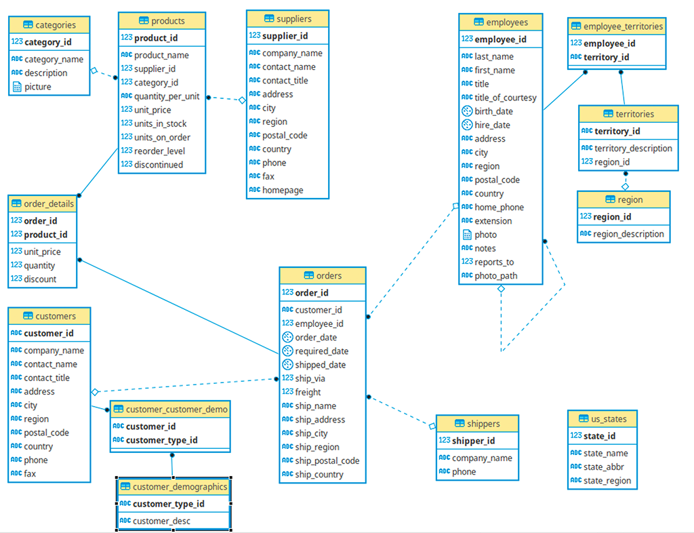

# Northwind API

Ejemplo de API CRUD sobre la base de datos `northwind` (PostgreSQL) construida con FastAPI,
SQLAlchemy 2.0 (async) y autenticación JWT.


## Instalación

```bash
pip install -e '.[dev]'
cp .env.example .env      # configurar las variables necesarias
```


## Migraciones

Las 14 tablas del esquema Northwind ya existen en la base de datos. La única migración gestionada por Alembic crea la tabla `users`, necesaria para la autenticación:

```bash
alembic upgrade head
```


## Arrancar la API

```bash
uvicorn app.main:app --reload
```

Documentación interactiva en `http://localhost:8000/docs`.


## Tests

```bash
pytest
```


## Lint / formato

```bash
ruff check .
ruff format .
```


## Autenticación

1. `POST /api/v1/auth/register` — alta de usuario (`username`, `password`).
2. `POST /api/v1/auth/login` — form `username`/`password`, devuelve `access_token` (JWT).
3. Enviar `Authorization: Bearer <token>` en las peticiones de escritura (`POST`/`PUT`/`DELETE`); la lectura (`GET`) es pública.


## Modelo de datos


